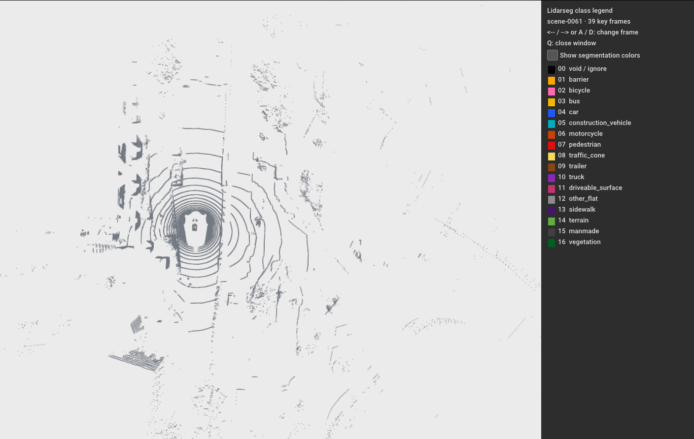
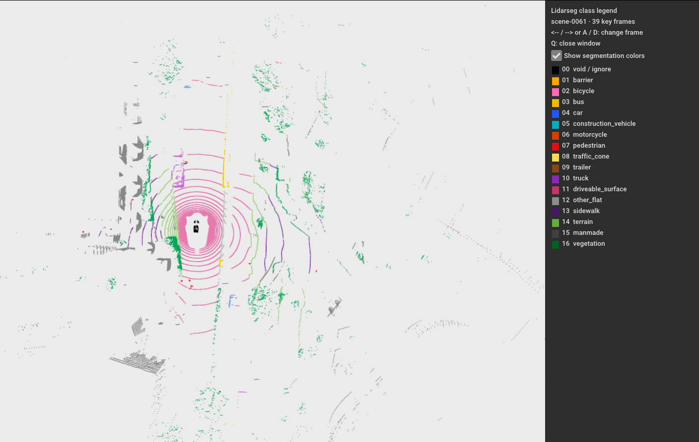

# LiDAR segmentation visualizer

An Open3D desktop viewer for choosing a nuScenes scene and browsing its ordered
`LIDAR_TOP` key frames, colored by their lidarseg semantic labels.

<p align="center">
  
  
</p>

## Create the Conda environment

```bash
conda env create -f environment.yml
conda activate lidar-segmentation-visualizer
```

## Browse a scene

With the dataset symlink in this repository, start the viewer and choose a
scene from the printed menu:

```bash
python visualize.py
```

Select directly by menu number or scene name:

```bash
python visualize.py --scene scene-0061
python visualize.py --scene 1 --start 10 --point-size 3
```

Use the left/right arrow keys or A/D to move through frames, and press Q to close
the window. Dataset
root and metadata version can be changed with `--dataroot` and `--version`.
nuScenes mini scenes contain 39–41 samples; the viewer loads every
`LIDAR_TOP` key frame in the selected scene and its matching lidarseg label.
The viewer uses metadata tokens to pair each scan with its label file. It shows
the point cloud on a white background and displays square color swatches beside
the 17 requested class IDs and names. Use **Show segmentation colors** to toggle
semantic coloring; when off, points use a uniform dark gray. nuScenes mini's 32
labels are grouped into this display scheme; unrelated labels are shown as
void/ignore.
The requested “sidebar” class is treated as `sidewalk`.

## Use the full nuScenes release

The viewer can use the full labeled train/validation release without code
changes. Extract the full dataset and nuScenes-lidarseg files into one root so
it contains `samples/`, `lidarseg/`, and `v1.0-trainval/`, then run:

```bash
python visualize.py --dataroot /path/to/full/nuscenes --version v1.0-trainval
```

You can also pass `--scene scene-XXXX` to select a scene directly. The current
viewer requires one segmentation label file for every frame, so it works with
the labeled `trainval` split. The `test` split does not provide ground-truth
lidarseg labels; viewing that split would need optional-label support or
prediction files.

## Code layout

- `lidar_visualizer/data.py` reads nuScenes metadata, scans, and labels.
- `lidar_visualizer/colors.py` defines the 17 display classes, palette, and
  nuScenes label mapping.
- `lidar_visualizer/viewer.py` builds the Open3D window and frame controls.
- `lidar_visualizer/cli.py` handles command-line arguments and startup.
- `visualize.py` remains a convenient entry point; `python -m lidar_visualizer`
  is also supported.
